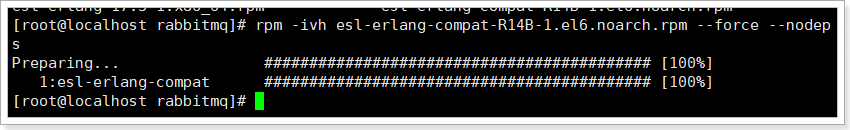

# 1. 下载

下载地址：http://www.rabbitmq.com/download.html

# 2. windows下安装

## 2.1.安装Erlang

下载：<http://www.erlang.org/download/otp_win64_17.3.exe>

安装：

 

 

 

 

 

安装完成。

 

如果出现：

 

请选择忽略。

 

## 2.2.安装RabbitMQ

 

 

 

安装完成。

 

 

启动、停止、重新安装等。

 

按下win + R 然后运行命令：services.msc

 

 

查看RabbitMQ服务有没有启动：

 

 

 

## 2.3.安装的注意事项

**1）推荐使用默认的安装路径**

**2）系统用户名必须是英文**

可以查看下用户目录：

 

也可以在桌面打开cmd查看路径：

 

**3**）计算机名必须是英文


**4）系统的用户必须是管理员**

 

## 2.4.启用管理工具

 

1、 点击

2、 输入命令：

rabbitmq-plugins enable rabbitmq_management
 

 

3、 在浏览器中输入地址查看：<http://127.0.0.1:15672/>

 

4、 使用默认账号登录：guest/ guest

 

## 2.5.安装失败解决方案

如果安装失败的同学应该如何解决：

l  **重装系统**  

--  不推荐

l  **将RabbitMQ安装到linux虚拟机中**

--  推荐

l  **使用别人安装好的RabbitMQ服务**

a)     只要给你开通一个账户即可。

b)     使用公用的RabbitMQ服务，在192.168.50.22

--  推荐

 

# 3. Linux下安装

cd /usr/local/leyou

mkdir rabbitmq

cd rabbitmq

 

## 3.1.安装Erlang

### 3.1.1.在线安装

```
yum install esl-erlang_17.3-1~centos~6_amd64.rpm

yum install esl-erlang-compat-R14B-1.el6.noarch.rpm
```


### 3.1.2.离线安装

上传课前资料中的安装包

Erlang：


 

依次执行命令：

1）rpm -ivh esl-erlang-17.3-1.x86_64.rpm --force --nodeps


 

2）rpm -ivh esl-erlang_17.3-1~centos~6_amd64.rpm --force --nodeps


3）rpm -ivh esl-erlang-compat-R14B-1.el6.noarch.rpm --force --nodeps


 

## 3.2.安装RabbitMQ

RabbitMQ：


上传后：


 

安装：

```
rpm -ivh rabbitmq-server-3.4.1-1.noarch.rpm
```



 

### 3.2.1.设置配置文件

```
cp /usr/share/doc/rabbitmq-server-3.4.1/rabbitmq.config.example /etc/rabbitmq/rabbitmq.config
```

开启用户远程访问

```
vi /etc/rabbitmq/rabbitmq.config
```

 

**注意要去掉后面的逗号。**

 

### 3.2.2.启动、停止

```
service rabbitmq-server start

service rabbitmq-server stop

service rabbitmq-server restart
```

 

### 3.2.3.开启web界面管理工具

```
rabbitmq-plugins enable rabbitmq_management

service rabbitmq-server restart
```

 

 

### 3.2.4.设置开机启动

```
chkconfig rabbitmq-server on
```

 

### 3.2.5.防火墙开放15672端口

```
/sbin/iptables -I INPUT -p tcp --dport 15672 -j ACCEPT

/etc/rc.d/init.d/iptables save
```

 

# 4.管理界面

## 2.1.主页总览


connections：无论生产者还是消费者，都需要与RabbitMQ建立连接后才可以完成消息的生产和消费，在这里可以查看连接情况

channels：通道，建立连接后，会形成通道，消息的投递获取依赖通道。

Exchanges：交换机，用来实现消息的路由

Queues：队列，即消息队列，消息存放在队列中，等待消费，消费后被移除队列。

 

端口：

5672: rabbitMq的编程语言客户端连接端口

15672：rabbitMq管理界面端口

25672：rabbitMq集群的端口

 

## 2.2.添加用户

如果不使用guest，我们也可以自己创建一个用户：


1、 超级管理员(administrator)

可登陆管理控制台，可查看所有的信息，并且可以对用户，策略(policy)进行操作。

2、 监控者(monitoring)

可登陆管理控制台，同时可以查看rabbitmq节点的相关信息(进程数，内存使用情况，磁盘使用情况等)

3、 策略制定者(policymaker)

可登陆管理控制台, 同时可以对policy进行管理。但无法查看节点的相关信息(上图红框标识的部分)。

4、 普通管理者(management)

仅可登陆管理控制台，无法看到节点信息，也无法对策略进行管理。

5、 其他

无法登陆管理控制台，通常就是普通的生产者和消费者。

 

## 2.3.创建Virtual Hosts

虚拟主机：类似于mysql中的database。他们都是以“/”开头


## 2.4.设置权限

 

 


