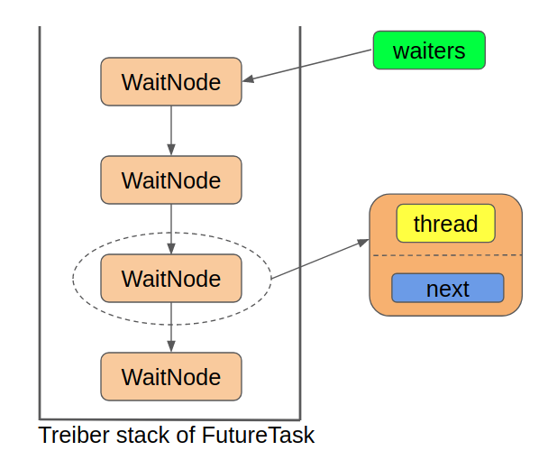

#### 1. RunnableFuture父接口

```java
public interface RunnableFuture<V> extends Runnable, Future<V> {
    /**
     * Sets this Future to the result of its computation
     * unless it has been cancelled.
     */
    void run();
}
```

#### 2. Future接口

Future接口代表异步计算的结果，通过Future接口提供的方法可以查看异步计算是否执行完成，或者等待执行结果并获取执行结果，同时还可以取消执行。Future接口的定义如下:

* `cancel()`:cancel()方法用来取消异步任务的执行。如果异步任务已经完成或者已经被取消，或者由于某些原因不能取消，则会返回false。如果任务还没有被执行，则会返回true并且异步任务不会被执行。如果任务已经开始执行了但是还没有执行完成，若mayInterruptIfRunning为true，则会立即中断执行任务的线程并返回true，若mayInterruptIfRunning为false，则会返回true且不会中断任务执行线程。
* `isCanceled()`:判断任务是否被取消，如果任务在结束(正常执行结束或者执行异常结束)前被取消则返回true，否则返回false
* `isDone()`:判断任务是否已经完成，如果完成则返回true，否则返回false。需要注意的是：任务执行过程中发生异常、任务被取消也属于任务已完成，也会返回true。
* `get()`:获取任务执行结果，如果任务还没完成则会阻塞等待直到任务执行完成。如果任务被取消则会抛出CancellationException异常，如果任务执行过程发生异常则会抛出ExecutionException异常，如果阻塞等待过程中被中断则会抛出InterruptedException异常。
* `get(long timeout,Timeunit unit)`:带超时时间的get()版本，如果阻塞等待过程中超时则会抛出TimeoutException异常。

```java
public interface Future<V> {
    boolean cancel(boolean mayInterruptIfRunning);
    boolean isCancelled();
    boolean isDone();
    V get() throws InterruptedException, ExecutionException;
    V get(long timeout, TimeUnit unit)
        throws InterruptedException, ExecutionException, TimeoutException;
}
```

#### 3. FutureTask类

##### 3.1 FutureTask类关系


##### 3.2 WaitNode内部类

FutureTask中的这个单向链表是当做**栈**来使用的，确切来说是当做Treiber栈来使用的，那么使用这个队列就只需要一个指向栈顶节点的指针就行了，在FutureTask中，就是`waiters`属性：它就是整个单向链表的头节点

```java
static final class WaitNode {
        volatile Thread thread;
        volatile WaitNode next;
        WaitNode() { thread = Thread.currentThread(); }
    }
```

队列结构图：



##### 3.3 核心属性

```java
//表示当前task的状态
    private volatile int state;

    //当前任务尚未执行
    private static final int NEW          = 0;
    //当前任务正在执行中。
    private static final int COMPLETING   = 1;
    //当前任务正常结束
    private static final int NORMAL       = 2;
    //当前任务执行过程中发生了异常,内部封装的callable.run()向上抛出异常了
    private static final int EXCEPTIONAL  = 3;
    //当前任务被取消
    private static final int CANCELLED    = 4;
    //当前任务中断中...
    private static final int INTERRUPTING = 5;
    //当前任务已中断
    private static final int INTERRUPTED  = 6;

    //submit(runnable/callable) runnable使用装饰者模式伪装成callable接口
    private Callable<V> callable;

    //正常情况，任务正常执行结束，outcome保存执行结果。callable的返回值
    //非正常情况：callable向上抛出异常，outcome保存异常
    private Object outcome; 

    //当前任务被线程执行期间，保存当前执行任务的线程对象引用。
    private volatile Thread runner;

    //因为会有很多线程去get当前任务的结果，所以这里使用了一种数据结构吧 stack(头插头取的一个队列)
    private volatile WaitNode waiters;
```

##### 3.4 构造函数

* `FutureTask(Callable<V> callable)`

这个构造函数会把传入的Callable变量保存在this.callable字段中，该字段定义为`private Callable<V> callable`;用来保存底层的调用，在被执行完成以后会指向null,接着会初始化state字段为NEW。

```java
public FutureTask(Callable<V> callable) {
        if (callable == null)
            throw new NullPointerException();
        //callable就是程序员自己实现的业务类
        this.callable = callable;
        //设置当前任务状态为NEW
        this.state = NEW;       // ensure visibility of callable
    }
```

* `FutureTask(Runnable runnable, V result)`

使用适配器模式将runnable转换为了callable接口，同时如果任务执行成功的话就会返回传入的result。这种情况下如果不需要返回值的话可以传入一个null。

```java
public FutureTask(Runnable runnable, V result) {
        //使用适配器模式将runnable转换为了callable接口，
        //外部线程通过get获取返回值，当前线程执行结束时，结果可能为null也可能为传入的值。
        this.callable = Executors.callable(runnable, result);
        this.state = NEW;       // ensure visibility of callable
    }
```

* `Executors.callable()`:这个方法的功能是把Runnable转换成Callable

```java
public static <T> Callable<T> callable(Runnable task, T result) {
        if (task == null)
            throw new NullPointerException();
        return new RunnableAdapter<T>(task, result);
    }
```

* 可以看到这里采用的是适配器模式，调用`RunnableAdapter<T>(task, result)`方法来适配，实现如下:

```java
static final class RunnableAdapter<T> implements Callable<T> {
        final Runnable task;
        final T result;
        RunnableAdapter(Runnable task, T result) {
            this.task = task;
            this.result = result;
        }
        public T call() {
            task.run();
            return result;
        }
    }
```

##### 3.5 核心方法-run()

```java
/**
     * 1. 通过ExecutorService.submit(runnable/callable)
     * 2. 线程池通过newTaskFor()方法创建FutureTask实例(new FutureTask<T>(runnable, value))
     * 3. new FutureTask<T>(runnable, value) 通过适配器将runnable转换为callable
     * 4. executor.execute()提交到线程池;
     */
    public void run() {
        /**
         * 条件一：state != NEW
         *      true-->当前task已经被执行过了或者被cancel了。总之非NEW状态的任务，线程就不处理了
         * 条件二：!UNSAFE.compareAndSwapObject(this, runnerOffset,null, Thread.currentThread())
         *      true-->CAS失败，已经有其他线程进来过（将成员变量runner置为当前线程对象）。
         */
        if (state != NEW ||
            !UNSAFE.compareAndSwapObject(this, runnerOffset,
                                         null, Thread.currentThread()))
            return;
        /**
         * 执行到这里，当前task一定是NEW状态，并且当前线程抢占TASK成功。
         */
        try {
            //callable就是程序员自己封装逻辑的callable或者适配后runnable
            Callable<V> c = callable;
            /**
             * 条件一：c != null  防止空指针异常
             * 条件二：state == NEW  防止外部线程cancel掉当前任务。
             */
            if (c != null && state == NEW) {
                // 结果的引用
                V result;

                //true:表示callable.run代码块执行成功，未发生异常
                boolean ran;
                try {
                    //调用程序员自己实现的callable 或者 适配后的runnable
                    result = c.call();
                    //c.call未抛出任何异常
                    ran = true;
                } catch (Throwable ex) {
                    result = null;
                    ran = false;
                    //把返回值设置为抛出的异常。并将线程状态设置为异常结束状态。
                    setException(ex);
                }
                if (ran)
                    //设置结果到outcome
                    set(result);
            }
        } finally {
            // runner must be non-null until state is settled to
            // prevent concurrent calls to run()
            runner = null;
            // state must be re-read after nulling runner to prevent
            // leaked interrupts
            int s = state;
            if (s >= INTERRUPTING)
                //如果是中断中状态，循环Thread.yield();直到状态不是INTERRUPTING
                handlePossibleCancellationInterrupt(s);
        }
    }
```

##### 3.6 核心方法-get()

FutureTask 通过get()方法获取任务执行结果。如果任务处于未完成的状态(`state <= COMPLETING`)，就调用awaitDone方法等待任务完成。任务完成后，通过report方法获取执行结果或抛出执行期间的异常。

```java
//应用场景：多个线程等待当前任务执行完成之后的结果
    public V get() throws InterruptedException, ExecutionException {
        int s = state;
        //条件成立说明：正在执行或者未执行状态，调用get的外部线程会被阻塞在get方法上。
        if (s <= COMPLETING)

            s = awaitDone(false, 0L);
        return report(s);
    }
```

##### 3.7 核心方法-awaitDone()

```java
private int awaitDone(boolean timed, long nanos)
        throws InterruptedException {
        //0：不带超时
        final long deadline = timed ? System.nanoTime() + nanos : 0L;
        //引用当前线程封装成 WaitNode 对象
        WaitNode q = null;

        //表示当前线程 WaitNode对象有没有 (入队/压栈)
        boolean queued = false;
        for (;;) {
            /**
             * Thread.interrupted()条件成立：说明当前线程是被其他线程使用 中断 这种方式唤醒的
             *  返回true后会将Thread的中断标记重置为false。也就是说只有一次有效，第二次自旋到这，就是false了
             */
            if (Thread.interrupted()) {
                //当前线程node出队。
                removeWaiter(q);
                //get方法抛出中断异常。
                throw new InterruptedException();
            }
            /**
             * 假设当前线程是被其他线程使用unpark(thread) 唤醒的话。会正常自旋，走下面的逻辑
             */
            //获取当前任务最新的状态。
            int s = state;
            /**
             * 条件成立说明：当前任务已经有结果了。可能是正常结束，也可能异常结束
             */
            if (s > COMPLETING) {

                //条件成立：说明已经为当前线程创建过node了，此时需要将Node.thread = null (helpGC)
                if (q != null)
                    q.thread = null;
                //直接返回当前状态。
                return s;
            }
            /**
             * 条件成立说明：说明当前任务接近完成状态。
             * 表示任务已经结束但是任务执行线程还没来得及给outcome赋值。
             * 这个时候让出执行权让其他线程优先执行
             */
            else if (s == COMPLETING) // cannot time out yet
                Thread.yield();

            /**
             * 条件成立：第一次自旋，当前线程还未创建WaitNode对象，此时为当前线程创建WaitNode对象。
             */
            else if (q == null)
                q = new WaitNode();
            /**
             * 条件成立：第二次自旋，当前线程已经创建WaitNode对象，但是Node对象还未入队。
             * q.next = waiters 当前线程Node节点next指向原队列的头节点。 waiters一直指向队列的头
             */
            else if (!queued)
                //CAS方式将当前节点的WaitNode对象(入队/压栈):如果返回false，说明其他线程先你一步(入队/压栈)，继续自旋尝试。
                queued = UNSAFE.compareAndSwapObject(this, waitersOffset,
                                                     q.next = waiters, q);
            /**
             * 条件成立：第三次自旋，
             */
            else if (timed) {
                nanos = deadline - System.nanoTime();
                if (nanos <= 0L) {
                    removeWaiter(q);
                    return state;
                }
                LockSupport.parkNanos(this, nanos);
            }
            else
                //当前get操作的线程就会被park了，线程状态会变成waiting状态，相当于休眠了
                //除非有其他线程将你唤醒，或者将当前线程中断。
                LockSupport.park(this);
        }
    }
```

##### 3.8 核心方法-cancel()

```java
public boolean cancel(boolean mayInterruptIfRunning) {
        /**
		 * FutureTask不为New状态，那么直接返回false
         * 条件一：state == NEW，表示当前任务尚未执行
         * 条件二：UNSAFE.compareAndSwapInt(this, stateOffset, NEW, mayInterruptIfRunning ? INTERRUPTING : CANCELLED)
         *  根据传入的参数mayInterruptIfRunning：
         *      true：将NEW状态的线程设置成中断中状态
         *      false:将NEW状态的线程设置为被取消状态
         */
        if (!(state == NEW &&
              UNSAFE.compareAndSwapInt(this, stateOffset, NEW,
                  mayInterruptIfRunning ? INTERRUPTING : CANCELLED)))
            return false;
        try {    // in case call to interrupt throws exception
            if (mayInterruptIfRunning) {
                try {
                    //指向当前FutureTask的线程。有可能是null：当前任务在队列中还没有线程获取它。
                    Thread t = runner;
                    //条件成立：说明当前线程runner正在执行task
                    if (t != null)
                        //给runner线程一个中断信号。。如果程序响应中断，会走中断逻辑，如果你程序是不响应中断的，就什么都不会做。
                        t.interrupt();
                } finally { // final state
                    //设置任务状态为中断完成
                    UNSAFE.putOrderedInt(this, stateOffset, INTERRUPTED);
                }
            }
        } finally {
            /**
             * 唤醒所有get()堵塞的线程。
             */
            finishCompletion();
        }
        return true;
    }
```

##### 3.9 set()方法

```java
protected void set(V v) {
        /**
         * 使用CAS方式设置当前任务状态为完成中
         * 有没有可能失败呢？
         *  外部线程等不及了，直接在set执行CAS之前将task Cancel(取消)了。
         */
        if (UNSAFE.compareAndSwapInt(this, stateOffset, NEW, COMPLETING)) {
            outcome = v;
            //将结果赋值给outcome之后，马上会将当前任务状态修改为NORMAL(正常结束状态)。
            UNSAFE.putOrderedInt(this, stateOffset, NORMAL); // final state

            /**
             *
             */
            finishCompletion();
        }
    }
```

##### 3.10 report()方法

```java
private V report(int s) throws ExecutionException {
        /**
         * 正常情况下：outcome保存的是callable运行结束的结果
         * 非正常情况：保存的是callable抛出的异常
         */
        Object x = outcome;

        //正常结束。
        if (s == NORMAL)
            return (V)x;

        //线程被取消状态或者被中断
        if (s >= CANCELLED)
            throw new CancellationException();

        //执行到这，说明callable接口实现中是有bug的
        throw new ExecutionException((Throwable)x);
    }
```

##### 3.11 finishCompletion()方法

```java
private void finishCompletion() {
        // assert state > COMPLETING;
        //q指向waiters链表的头结点
        for (WaitNode q; (q = waiters) != null;) {

            //使用cas设置waiters为null：是因为怕外部线程使用cancel取消当前任务，也会触发finishCompletion。
            if (UNSAFE.compareAndSwapObject(this, waitersOffset, q, null)) {
                for (;;) {
                    //获取当前node节点封装的 thread
                    Thread t = q.thread;
                    if (t != null) {
                        //help GC
                        q.thread = null;

                        //唤醒当前节点对应的线程。
                        LockSupport.unpark(t);
                    }
                    WaitNode next = q.next;
                    if (next == null)
                        break;
                    q.next = null; // unlink to help gc
                    q = next;
                }
                break;
            }
        }

        done();
        //将callable设置为空 help GC
        callable = null;        // to reduce footprint
    }
```

##### 3.12 removeWaiter()方法

```java
private void removeWaiter(WaitNode node) {
        if (node != null) {
            node.thread = null;
            retry:
            for (;;) {          // restart on removeWaiter race
                for (WaitNode pred = null, q = waiters, s; q != null; q = s) {
                    s = q.next;
                    if (q.thread != null)
                        pred = q;
                    else if (pred != null) {
                        pred.next = s;
                        if (pred.thread == null) // check for race
                            continue retry;
                    }
                    else if (!UNSAFE.compareAndSwapObject(this, waitersOffset,
                                                          q, s))
                        continue retry;
                }
                break;
            }
        }
    }
```

