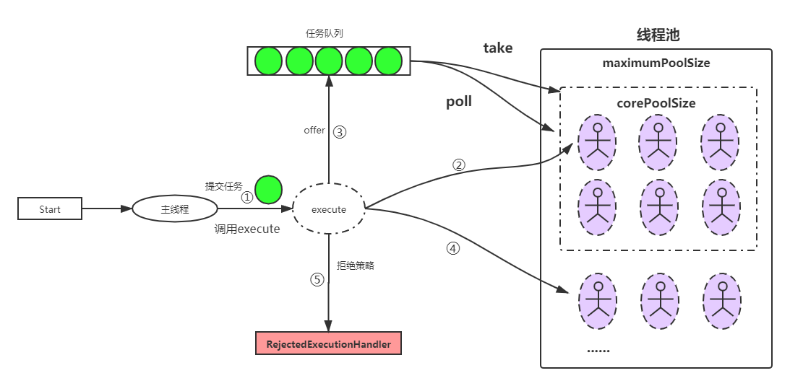
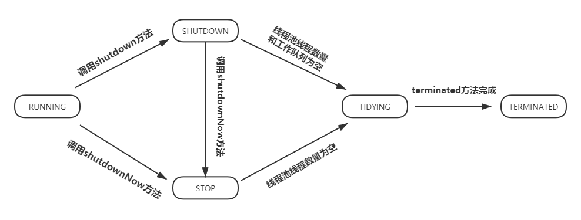
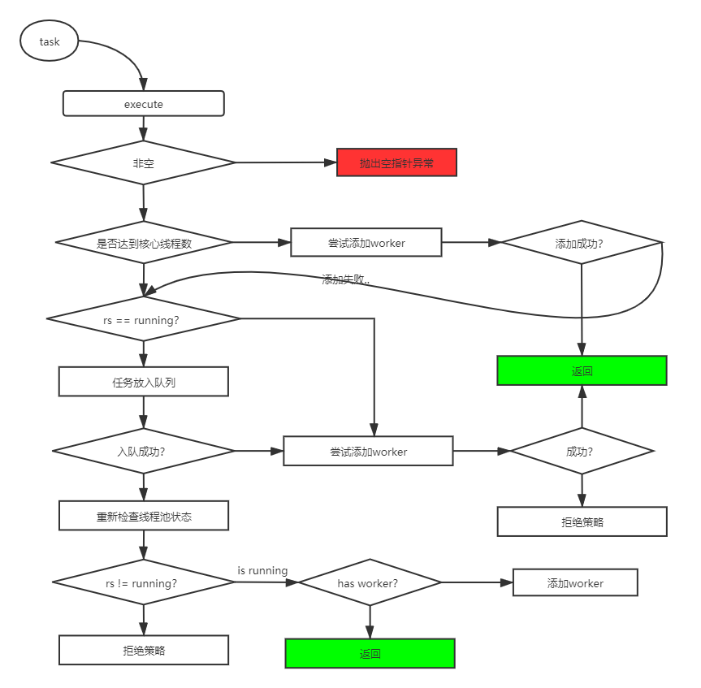

#### 1.线程池基本概念

##### 1.1工作流程



##### 1.2 工作状态



#### 2. 核心属性

##### 2.1 静态属性

```java
	//高2位：表示当前线程池运行状态 除去高3位之后的低位：表示当前线程池中所拥有的线程数量。
    private final AtomicInteger ctl = new AtomicInteger(ctlOf(RUNNING, 0));

    //表示ctl中，低COUNT_BITS位，用于存放当前线程数据的位（JDK有些版本Integ为16位，有的为32位）。
    private static final int COUNT_BITS = Integer.SIZE - 3;
    //低COUNT_BITS位 表示表达的最大值。 0001 1111 .... 1111 ==> 5亿多
    private static final int CAPACITY   = (1 << COUNT_BITS) - 1;

    // runState is stored in the high-order bits
    /**
     * 负数使用补码表示，补码=反码 + 1
     * 1 ==> 原码：.... 0000 0001
     *       反码：.... 1111 1110
     *    反码+1 : .... 1111 1111
     * -1 ==> .... 1111 1111
     * 左移29位 ==> 1110 0000 .... 0000
     */
    private static final int RUNNING    = -1 << COUNT_BITS;
    //0000 0000 .... 0000
    private static final int SHUTDOWN   =  0 << COUNT_BITS;
    //0001 0000 .... 0000
    private static final int STOP       =  1 << COUNT_BITS;
    //0100 0000 .... 0000
    private static final int TIDYING    =  2 << COUNT_BITS;
    //0110 0000 .... 0000
    private static final int TERMINATED =  3 << COUNT_BITS;

    /**
     * 缺省(默认)抛出异常的方式
     */
    private static final RejectedExecutionHandler defaultHandler =
        new AbortPolicy();
```

##### 2.2 成员属性

```java
	/**
     * 任务队列 ：当线程池中的线程达到核心线程数量时，再提交任务，就会直接提交到workQueue中
     * workQueue instanceOf ArrayBrokingQueue LinkedBrokingQueue 同步队列
     */
    private final BlockingQueue<Runnable> workQueue;

    /**
     * 线程池全局锁：1.增加worker 2.减少worker 3.修改线程池状态 时需要持有mainLock锁
     */
    private final ReentrantLock mainLock = new ReentrantLock();

    /**
     * 线程池中真正存放 worker(线程)的地方
     */
    private final HashSet<Worker> workers = new HashSet<Worker>();

    /**
     * 当外部线程调用 awaitTermination()方法时，外部线程会等待当前线程池状态为 Termination 为止。
     * 等待是如何实现的？
     *      就是将外部线程封装成 waitNode 放入到 Condition队列中了。waitNode.Thread就是外部线程，会被park掉(处于WAITING状态)
     *      当线程池状态变为 Termination状态时，会去唤醒这些线程，通过当前termination.signalAll()唤醒,
     *      唤醒的这些线程会进入 阻塞队列，然后头节点会去抢占mainLock，抢占到的线程，会继续执行awaitTermination()后面的程序。
     *      这些线程最后都会正常执行。
     * 简单理解：temination.await() 会将线程阻塞在这
     *          temination.signalAll() 会将阻塞在这的线程依次唤醒
     */
    private final Condition termination = mainLock.newCondition();

    /**
     * 记录线程池生命周期内，线程数最大值
     */
    private int largestPoolSize;

    /**
     * 记录线程池所完成任务总数，当worker退出时，会将worker完成的任务累加到completedTaskCount中
     */
    private long completedTaskCount;

    /**
     * 创建线程时会使用线程工厂。
     * 当我们使用 Executors.newFix.. 和 newCache... 创建线程池时，使用的是DefaultThreadFactory
     * 一般不建议使用Default线程池，推荐自己实现ThreadFactory
     */
    private volatile ThreadFactory threadFactory;

    /**
     * 拒绝方式：JUC包提供了4中方式，默认采用 Abort..抛出异常的方式
     */
    private volatile RejectedExecutionHandler handler;

    /**
     * 空闲线程存活时间，
     * 当 allowCoreThreadTimeOut = false 时，会维护核心线程数量内的线程存活，超出部分会被超时.
     * 当 allowCoreThreadTimeOut = false 时，核心数量内的线程空闲时，也会被回收
     */
    private volatile long keepAliveTime;

    /**
     *  控制核心线程数量内的线程 是否可以被回收，true可以，false不可以
     */
    private volatile boolean allowCoreThreadTimeOut;

    /**
     * 核心线程数量限制
     */
    private volatile int corePoolSize;

    /**
     * 线程池最大线程数量限制
     */
    private volatile int maximumPoolSize;
```

#### 3. 内部小方法

##### 3.1 runStateOf()

* 获取当前线程池运行状态

```java
	//获取当前线程池运行状态
    private static int runStateOf(int c)     { return c & ~CAPACITY; }
```

##### 3.2 workerCountOf()

* 获取当前线程池运行的线程数量

```java
 	//获取当前线程池运行的线程数量
    private static int workerCountOf(int c)  { return c & CAPACITY; }
```

##### 3.3 ctlOf()

* 用在重置当前线程ctl值

```java
	/**
     * 用在重置当前线程ctl值
     * rs：表示线程池状态
     * wc：表示当前线程池中worker(线程)数量
     * */
    private static int ctlOf(int rs, int wc) { return rs | wc; }
```

##### 3.4 runStateLessThan()

* 比较当前线程池ctl所表示的状态，是否小于某个状态s

```java
	/**
     * 比较当前线程池ctl所表示的状态，是否小于某个状态s
     * RUNNING < SHUTDOWN < STOP < TIDYING < TERMINATED
     * */
    private static boolean runStateLessThan(int c, int s) {
        return c < s;
    }
```

##### 3.5 runStateAtLeast()

```
/** 比较当前线程池ctl所表示的状态，是否大于等于某个状态s */
    private static boolean runStateAtLeast(int c, int s) {
        return c >= s;
    }
```

##### 3.6 isRunning()

```java
	/** 比较当前线程池ctl所表示的状态，是否小于SHUTDOWN状态 也就是判断是否是RUNNING状态*/
    private static boolean isRunning(int c) {
        return c < SHUTDOWN;
    }
```

##### 3.7 compareAndIncrementWorkerCount()

```java
	/** 使用CAS方式让ctl值+1 */
    private boolean compareAndIncrementWorkerCount(int expect) {
        return ctl.compareAndSet(expect, expect + 1);
    }
```

##### 3.8 compareAndDecrementWorkerCount()

```java
	/** 使用CAS方式让ctl值-1 */
    private boolean compareAndDecrementWorkerCount(int expect) {
        return ctl.compareAndSet(expect, expect - 1);
    }

    /** 通过自旋+CAS的方式让ctl的值 -1 */
    private void decrementWorkerCount() {
        //一直自旋重试，直到成功为止
        do {} while (! compareAndDecrementWorkerCount(ctl.get()));
    }
```

#### 4. 内部类-worker

##### 4.1 核心属性

```java
	/** worker内部封装的工作线程 */
    final Thread thread;
    /**
    * 假设firstTask不为空，那么当Worker启动后(内部的线程启动)会优先执行firstTask，
    * 当执行完firstTask后，会到queque中获取下一个任务.
    */
    Runnable firstTask;
    /** 记录当前worker所完成任务数量 */
    volatile long completedTasks;
```

##### 4.2 核心方法

###### 4.2.1 构造方法

```java
	//firstTask 可以为null 为null时启动后回到queue中获取
	Worker(Runnable firstTask) {
            //设置AQS独占模式为初始化状态，这时候不能被抢占锁
            setState(-1); // inhibit interrupts until runWorker
            this.firstTask = firstTask;
            //使用线程工厂创建一个线程，并将当前worker指定为Runnable。也就是说当thread启动的时候，会以worker.run()方法为入口
            this.thread = getThreadFactory().newThread(this);
        }
```

###### 4.2.2 重写run()方法

```java
	/** 当worker启动时会执行run方法  */
    public void run() {
    //调用ThreadPoolExecutor.runWorker() 这个是核心方法。
    runWorker(this);
    }
```

###### 4.2.3 isHeldExclusively()

```java
    /**
    * 判断当前worker的独占锁是否被占用
    *  0：未被占用
    *  1：已被占用
    * */
    protected boolean isHeldExclusively() {
    return getState() != 0;
    }
```

###### 4.2.4 tryAcquire()

```java
	/**尝试去获取worker的独占锁*/
    protected boolean tryAcquire(int unused) {
    /**使用CAS修改 AQS中的 state 期望值为0(表示未被占用)，修改成功表示当前线程抢占成功*/
    if (compareAndSetState(0, 1)) {
    setExclusiveOwnerThread(Thread.currentThread());
    return true;
    }
    return false;
    }
```

###### 4.2.5 tryRelease()

```java
	/**尝试去释放锁：外部不会直接调用这个方法，是AQS内调用的。
    * 外部调用unlock是，unlock->AQS.release() -> tryRelease()
    * */
    protected boolean tryRelease(int unused) {
    setExclusiveOwnerThread(null);
    setState(0);
    return true;
    }
```

###### 4.2.6 加锁方法

```java
	/**加锁，加锁失败时，会阻塞当前线程，知道获得锁为止*/
    public void lock()        { acquire(1); }
    /**尝试去加锁，如果当前锁是未被持有状态，那么加锁成功后，会返回true，否则直接返回false*/
    public boolean tryLock()  { return tryAcquire(1); }
```

###### 4.2.7 unlock()--释放锁

```java
	/**一般情况下，咱们调用unlock要保证当前线程是持有锁的。
    * 特殊情况：当worker的state=-1时调用unlock 表示初始化state 设置state = 0
    *      启动worker之前会先调用unlock()这个方法：会强制刷新ExclusiveOwnerThread == null state == 0
    * */
    public void unlock()      { release(1); }
```

###### 4.2.8 isLocked()

```java
	/**返回当前woker的lock是否被占用*/
    public boolean isLocked() { return isHeldExclusively(); }
```

#### 5. 核心方法

##### 5.1 execute()

###### 5.1.1 执行流程图



###### 5.1.2 源代码

```java
//command 可以是普通的Runnable实现类，也可以是 FutureTask
public void execute(Runnable command) {

    if (command == null)
        throw new NullPointerException();

    /**获取ctl最新的值。ctl：高三位表示线程池状态，低位表示当前线程池的线程数量*/
    int c = ctl.get();
    /**
     * workerCountOf(c)：获取当前线程数量
     * 条件成立：表示当前线程数量小于核心线程数量，
     *          此次提交任务，直接创建一个新的worker.对应线程池中多了一个新的线程
     * */
    if (workerCountOf(c) < corePoolSize) {
        /**
         * addWorker：即为创建线程的过程，会创建worker对象，并将command作为firstTask
         * core == true：表示采用核心线程数量限制
         * core == false 表示采用maximumPoolSize
         *
         * 条件成立：表示创建成功，直接返回即可。addWorker方法里面会启动新创建的worker，将firstTask执行。
         * */
        if (addWorker(command, true))
            return;
        /**
         * 执行到这里：说明addWorker一定是创建失败了。
         * 有几种可能会失败呢？
         *  1.存在并发现象，execute方法是可以有多个线程同时调用的，当workerCountOf(c) < corePoolSize成立后，
         *    其他线程可能也成立了，并且向线程池中创建了worker。这时候线程中的核心线程数已经达到。
         *  2.当前线程池的状态发生了改变。RUNNING SHUTDOWN STOP TIDYING TERMINATION
         *    当线程池状态为非RUNNING状态时，addWorker(firstTask != null , true|false)一定会失败。
         *    当firstTask == null时，SHUTDOWN状态也会创建成功。
         * */
        c = ctl.get();
    }
    /**
     * 执行到这里有几种情况：
     *      1.当前线程数量已经达到corePoolSize
     *      2.addWorker失败了...
     * 条件成立：说明当前线程池处于RUNNING状态，尝试将 task 放入workQueue中。
     */
    if (isRunning(c) && workQueue.offer(command)) {
        /**再次获取到ctl*/
        int recheck = ctl.get();

        /**
         * 条件一：! isRunning(recheck)
         *      true：说明你提交到队列之后，线程状态被外部线程给修改了,。比如：shutdown() shutdownNow()
         *            这种情况需要吧刚刚提交到队列中的任务删除掉
         * 条件二：remove(command)
         *      true：说明提交之后，线程池中的线程还未消费(处理)
         *      false：说明提交之后，在shutdown() shutdownNow()之前，就被线程中的线程消费掉了(处理了)。
         */
        if (! isRunning(recheck) && remove(command))
            //提交之后线程状态为非RUNNING，并且提交的任务未被消费，出队成功，执行拒绝策略
            reject(command);
        /***
         * 有几种情况会来到这？
         *      1.当前线程池是RUNNING状态 (这个概率最大)
         *      2.当前线程池是非RUNNING状态，但是remove()移除提交的任务失败
         *
         * 担心当前线程池是running状态，但是线程池中的存活线程数量是0，这时候，如果是0的话，会很尴尬，任务没有线程去跑了。
         * 这里其实就是一个担保机制，保证线程池在running状态下，最起码有一个线程再工作。
         */
        else if (workerCountOf(recheck) == 0)
            addWorker(null, false);
    }

    /**
     * 执行到这里，有几种情况
     *  1.队列的offer操作失败。
     *  2.当前线程池是非RUNNING状态。
     *
     * 1.offer失败，需要做什么？说明当前queue满了！这时候如果当前线程数量未达到maximumPoolSize的话，会创建新的worker直接执行command
     * 2.线程池状态为非RUNNING状态，这时候因为command！=null addWorker一定会返回false，执行拒绝策略
     */
    else if (!addWorker(command, false))
        reject(command);
}
```

##### 5.2 addWorker()

```java
	/**
     * 返回值总结
     *  true 表示创建worker成功，且启动成功
     *  false 表示创建失败，
     *      1.线程状态rs > SHUTDOWN (STOP/TIDYING/TERMINATION)
     *      2.rs == SHUTDOWN 但是队列中已经没有任务了，当前状态是SHUTDOWN且队列为空，但是firstTask不为null
     *      3.当前线程池已经达到指定指标(corePoolSize 或者 maximumPollSize)
     *      4.ThreadFactory创建的线程是null
     * */
    private boolean addWorker(Runnable firstTask, boolean core) {
        retry:
        /**外层自旋：判断线程的状态*/
        for (;;) {
            /**获取当前ctl值*/
            int c = ctl.get();
            /**获取当前线程池状态*/
            int rs = runStateOf(c);

            /**
             * 条件一：rs >= SHUTDOWN
             *      true：说明当前线程池状态不是RUNNING状态
             * 条件二：前置条件：当前线程池状态不是RUNNING状态。
             *  ! (rs == SHUTDOWN && firstTask == null && ! workQueue.isEmpty())
             *     排除掉这些情况( 1. 当前线程池状态为SHUTDOWN 2.提交的任务是空 3.当前任务队列不是空 )
             * */
            if (rs >= SHUTDOWN &&
                ! (rs == SHUTDOWN &&
                   firstTask == null &&
                   ! workQueue.isEmpty()))
                /**
                 * 什么情况下会返回false呢？
                 *  1.线程状态 rs > SHUTDOWN
                 *  2.rs == SHUTDOWN 但是firstTask != null
                 *  3.rs == SHUTDOWN && firstTask == null 但是队列中已经没有任务
                 */
                return false;

            /**
             * 上面的这些代码，就是判断当前线程池状态，是否允许添加线程。
             * 内层自旋：获取创建线程令牌的过程
             */
            for (;;) {
                /** 获取当前线程池中的线程数量 */
                int wc = workerCountOf(c);

                /**
                 * 条件一：wc >= CAPACITY 几乎不可能成立，因为CAPACITY是一个5亿多的数字.
                 * 条件二：wc >= (core ? corePoolSize : maximumPoolSize)
                 *      当core == true时，去判断当前线程数量是否大于核心线程数量限制
                 *      当core == false时，去判断当前线程数量是否大于最大线程数量限制
                 */
                if (wc >= CAPACITY ||
                    wc >= (core ? corePoolSize : maximumPoolSize))
                    /**执行到这里，说明当前无法添加线程了，已经达到了指定限制了。*/
                    return false;
                /**
                 * 通过CAS的方式将ctl(也就是线程数量)的值加一，相当于申请到了一个令牌
                 * 什么时候会失败？
                 * 1.其他线程execute() 在你之前申请过令牌(也就是加一)了
                 * 2.外部线程可能调用了shutdown() 或者 shutdownNow() 导致线程状态发生了改变，
                 *      因为ctl 高三位是表示线程池状态
                 */
                if (compareAndIncrementWorkerCount(c))
                    /**直接跳出了 retry 外部这个for自旋*/
                    break retry;

                /**
                 * CAS失败，没有申请到令牌。
                 * 获取最新的ctl的值
                 */
                c = ctl.get();  // Re-read ctl
                /**判断当前线程池的状态是否发生过变化，如果外部在这之前调用过shutdown() 或者 shutdownNow() 会导致状态的变化*/
                if (runStateOf(c) != rs)
                    /**状态发生变化后，直接返回到外层循环，外层循环负责判断当前线程状态*/
                    continue retry;
                // else CAS failed due to workerCount change; retry inner loop
            }
        }

        /**
         * workerStarted：表示创建的worker是否启动，false：未启动
         * workerAdded：表示创建的orker是否添加到线程池中，false：未添加
         * w：表示创建worker的 一个引用
         */
        boolean workerStarted = false;
        boolean workerAdded = false;
        Worker w = null;
        try {
            /**表示创建worker，执行完后，线程已经创建好了*/
            w = new Worker(firstTask);
            /**将新创建的worker节点的线程赋值给t*/
            final Thread t = w.thread;

            /**为什么要判断 t!=null?
             * 为了防止ThreadFactory实现类有bug，因为ThreadFactory是一个接口，谁都可以实现。
             * 万一哪个小哥哥脑子一热，创建出来的线程为null。
             *Doug lea考虑的比较全面，为了防止程序报空指针异常
             * */
            if (t != null) {
                /**将全局锁的引用保存到mainLock*/
                final ReentrantLock mainLock = this.mainLock;
                /**可能会阻塞，直到获取成功为止，同一时刻操作线程池内部相关的操作，都必须要持锁*/
                mainLock.lock();
                /**从这里加锁之后，其他线程是无法修改当前线程池的状态的*/

                try {
                    /**再次获取最新的线程池状态*/
                    int rs = runStateOf(ctl.get());

                    /**
                     * 条件一：rs < SHUTDOWN
                     *      true：当前线程池为RUNNING状态
                     * 条件二：(rs == SHUTDOWN && firstTask == null)
                     *      true：当前状态为SHUTDOWN状态，并且firstTask为空，
                     *              其实判断的就是SHUTDOWN状态下的特殊情况，只不过这里不再判断任务队列是否为空了。
                     *          为什么不需要判断任务队列为空了呢？
                     *              如果rs == SHUTDOWN && firstTask ！= null && workQueue ！= null
                     *              因为在SHUTDOWN状态下不能添加新的任务，只会完成已经提交过的任务队列。不管任务队列是不是为空，
                     *              只要firstTask不为空，就不能创建型的线程
                     */
                    if (rs < SHUTDOWN ||
                        (rs == SHUTDOWN && firstTask == null)) {
                        /**
                         * t.isAlive():当线程start之后，线程的状态就是alive状态
                         * 防止脑子发热的程序员，ThreadFactory创建线程返回外部之前，就将线程start了。。。
                         * */
                        if (t.isAlive()) // precheck that t is startable
                            throw new IllegalThreadStateException();

                        /**将我们创建的worker添加到线程池中*/
                        workers.add(w);
                        /**获取当前线程池最新的线程数量*/
                        int s = workers.size();
                        /**条件成立：说明当前线程数量是一个新高 ，更新largestPollSize*/
                        /**表示线程已经添加到线程池中了。*/
                        if (s > largestPoolSize)
                            largestPoolSize = s;
                        workerAdded = true;
                    }
                } finally {
                    /**释放线程池的全局锁*/
                    mainLock.unlock();
                }
                /**
                 * 条件成立：说明添加worker到线程池成功
                 * 条件失败：说明在获取到线程池的全局锁之前，线程池的状态发生了变化，导致了添加失败
                 * */
                if (workerAdded) {
                    t.start();
                    workerStarted = true;
                }
            }
        } finally {
            /**条件成立：说明添加线程到线程池失败。需要做清理工作*/
            if (! workerStarted)
                /**
                 * 失败时做什么清理工作？
                 * 1.释放令牌
                 * 2.将当前worker清理出workers线程池中。
                 * */
                addWorkerFailed(w);
        }
        return workerStarted;
    }

	private void addWorkerFailed(Worker w) {
        /**获取线程池的全局锁*/
        final ReentrantLock mainLock = this.mainLock;
        mainLock.lock();
        try {
            if (w != null)
                workers.remove(w);
            /**
             * 将线程池计数恢复：前面加1了，这里失败了。需要-1
             * 相当于归还令牌
             * */
            decrementWorkerCount();

            tryTerminate();
        } finally {
            /**释放线程池的全局锁*/
            mainLock.unlock();
        }
    }

```

##### 5.3 runWorker()

```java
	final void runWorker(Worker w) {
        /**
         * wt == w.thread
         * task = w.firstTask
         */
        Thread wt = Thread.currentThread();
        Runnable task = w.firstTask;
        w.firstTask = null;
        /**
         * 这里为什么要调用unlock？
         *  就是为了初始化worker (state==0 和 exclusiveOwnerThread == null)
         */
        w.unlock(); // allow interrupts

        /**是否突然退出。true：发生异常了，当前线程是突然退出的，回头需要做一些处理*/
        boolean completedAbruptly = true;
        try {
            /**
             * 条件一：task ！= null 指的就是firstTask不是null
             * 条件二：(task = getTask()) != null
             *      条件成立：说明当前线程再任务队列获取任务成功。
             *      getTask()是一个会阻塞线程的方法
             *          getTask()返回null，当前线程需要执行结束逻辑。
             */
            while (task != null || (task = getTask()) != null) {
                /**
                 * worker设置独占锁为当前线程
                 * 为什么要设置独占锁呢？
                 *      SHUTDOWN时会判断当前worker状态，根据独占锁是否空闲进行判断当前worker是否正在工作。
                 * */
                w.lock();
                /**
                 * 条件一：runStateAtLeast(ctl.get(), STOP)：说明当前线程池处于STOP/TIDYING/TERMINATION 此时线程一定要给他一个中断信号。
                 * runStateAtLeast(ctl.get(), STOP) == true && !wt.isInterrupted() == true
                 *      上面这两个如果成立：说明当前线程池状态一定>=STOP 且 当前线程的状态未设置成中断状态，此时需要进入if中尝试给当前线程一个中断信号
                 *
                 * 假设：runstateAtLieast(ctl.get(), STOP) == false
                 *  此时需要判断(Thread.interrupted() && runStateAtLeast(ctl.get(), STOP))
                 *      Thread.interrupted():获取当前线程的状态，并且将当前线程的中断位设置为false。也就是将线程的状态设置为未中断。
                 *      runStateAtLeast(ctl.get(), STOP) 大概率依旧为false。
                 *      综上所述：其实它这里就是为了强制将当前线程的中断标记位设置为false，因为有可能上一次执行task时，业务代码里面将当前线程的中断标记位设置为了true，且没有处理
                 *      这里就需要强制刷新一下。
                 * Thread.interrupted() == true && runStateAtLeast(ctl.get(), STOP)) == true这种情况有可能发生吗？
                 * 有可能：因为外部线程再第一次 判断(runStateAtLeast(ctl.get(), STOP) == false之后，调用了shutdown或者shutdownNow方法，
                 * 将线程池状态修改。这个时候也会将当前线程的中断标记位设置为中断状态。
                 */
                if ((runStateAtLeast(ctl.get(), STOP) ||
                     (Thread.interrupted() &&
                      runStateAtLeast(ctl.get(), STOP))) &&
                    !wt.isInterrupted())
                    wt.interrupt();

                try {
                    /**钩子函数，留给子类实现的*/
                    beforeExecute(wt, task);

                    /**表示异常情况，如果thrown不为空，表示task运行过程中，向上抛出异常了。*/
                    Throwable thrown = null;
                    try {
                        /**
                         * task可能为FutureTask 也可能是普通的Runnable接口实现类。
                         * 如果前面通过submit()提交的 runnable/callable 会被封装成 FutureTask
                         * */
                        task.run();
                    } catch (RuntimeException x) {
                        thrown = x; throw x;
                    } catch (Error x) {
                        thrown = x; throw x;
                    } catch (Throwable x) {
                        thrown = x; throw new Error(x);
                    } finally {
                        /**钩子方法，留给子类实现的*/
                        afterExecute(task, thrown);
                    }
                } finally {
                    /**将局部变量task设置为null*/
                    task = null;
                    /**更新worker完成任务数量*/
                    w.completedTasks++;
                    /**
                     * worker处理完一个任务后，会释放掉独占锁。再次到任务队列中获取任务
                     * 1.正常情况下，会再次回到while(getTask()...)那里获取情况
                     * 2.task.run()内部抛出异常了
                     */
                    w.unlock();
                }
            }
            /**
             * 什么情况下，会来到这里？
             * 1.getTask()方法返回null时，说明当前线程应该执行退出逻辑了。
             */
            completedAbruptly = false;
        } finally {
            /**
             * task.run()内部抛出异常了。直接从w.unlock()调到这一行
             * completedAbruptly==true：表示异常退出
             * completedAbruptly==false：表示正常结束
             * */
            processWorkerExit(w, completedAbruptly);
        }
    }
```

##### 5.4 getTask()

```java
private Runnable getTask() {
        /**表示当前线程获取任务是否超时，默认是false，true：表示已超时*/
        boolean timedOut = false; // Did the last poll() time out?

        for (;;) {
            /**
             * c：获取到的左心的ctl的值
             * rs：获取当前线程池的运行状态
             */
            int c = ctl.get();
            int rs = runStateOf(c);

            /**
             * 条件一：rs >= SHUTDOWN
             *      条件成立：说明当前线程池是非RUNNING状态
             * 条件二：(rs >= STOP || workQueue.isEmpty())
             *      条件2.1：rs >= STOP成立：说明当前任务状态最低也是STOP状态，一定要返回null了
             *      条件2.2：workQueue.isEmpty()：说明当前任务队列已经为空
             *
             * 返回null，runWorker方法就会将返回null的线程执行线程退出线程池的逻辑。
             */
            if (rs >= SHUTDOWN && (rs >= STOP || workQueue.isEmpty())) {
                //使用CAS+自旋的方式将 ctl值 -1
                decrementWorkerCount();
                return null;
            }

            /**
             * 执行到这里，有几种情况
             * 1.线程池是RUNNING状态
             * 2.线程池是SHUTDOWN状态，但是队列还未为空，此时可以创建线程。
             */
            //获取线程池中的线程数量
            int wc = workerCountOf(c);

            /**
             * timed == true 表示当前线程获取task时是支持超时机制的，使用queue.poll(xxx,xxx);
             *               当获取task超时的情况下，下一次自旋就有可能返回null了
             * time == false 表示当前线程获取task时不支持超时机制的，当前线程会使用queue.take();
             *
             * 情况一：allowCoreThreadTimeOut == true 表示核心线程数量内的线程，也可以被回收(所有线程都是支持超时机制的)。
             * 情况二：allowCoreThreadTimeOut == false 表示当前线程池会维护核心线程数量内的线程。
             * wc > corePoolSize 条件成立说明当前线程中的线程数量大于核心线程数的，此时所有的线程都是用poll 支持超时的方式取获取任务
             * 这样可能一有一部分线程获取不到任务，返回null，然后runWorker会执行退出逻辑。
             */
            boolean timed = allowCoreThreadTimeOut || wc > corePoolSize;

            /**
             * 条件一：(wc > maximumPoolSize || (timed && timedOut) 表示线程是否可以被回收
             *  1.1 wc > maximumPoolSize  为什么会成立？
             *      setMaximumPoolSize，可能外部线程将线程池最大线程数设置比初识化时的要小。
             *  1.2 time && timedOut 条件成立：当前线程使用poll方式获取task。并且在上一次循环时，获取任务超时了。
             * 条件二：(wc > 1 || workQueue.isEmpty()) 表示线程是否需要被回收
             *  2.1 wc > 1 条件成立说明当前线程池中还有其他线程，当前线程可以直接回收，
             *  2.2 workQueue.isEmpty() 条件成立说明，当前任务队列已经为空，最后一个线程也可以被回收。
             */
            if ((wc > maximumPoolSize || (timed && timedOut))
                && (wc > 1 || workQueue.isEmpty())) {
                /**使用CAS机制，让ctl值-1*/
                if (compareAndDecrementWorkerCount(c))
                    return null;
                /**
                 * 再次自旋时，timed有可能就是false了，因为当前线程cas失败，很有可能是因为其他线程先-1退出导致的，
                 * 当前线程可能就不需要回收的范围内了。
                 */
                continue;
            }

            try {
                Runnable r = timed ?
                    workQueue.poll(keepAliveTime, TimeUnit.NANOSECONDS) :
                    workQueue.take();
                if (r != null)
                    return r;
                timedOut = true;
            } catch (InterruptedException retry) {
                timedOut = false;
            }
        }
    }
```

##### 5.5 processWorkerExit()

```java
	private void processWorkerExit(Worker w, boolean completedAbruptly) {
        /**
         * 条件成立：标识当前w这个worker是发生异常退出的，task任务执行过程中向上抛出异常。。。
         * 异常退出时，ctl计数并没有减一
         */
        if (completedAbruptly) // If abrupt, then workerCount wasn't adjusted
            decrementWorkerCount();

        /**获取线程池的全局锁。*/
        final ReentrantLock mainLock = this.mainLock;
        //加锁
        mainLock.lock();
        try {
            /**将当前worker完成的task数量汇总到线程池的completedTaskCount*/
            completedTaskCount += w.completedTasks;
            /**将worker从线程池中移除*/
            workers.remove(w);
        } finally {
            /**释放全局锁*/
            mainLock.unlock();
        }

        tryTerminate();

        int c = ctl.get();
        /**条件成立说明当前线程池状态为RUNNING 或者 SHUTDOWN状态*/
        if (runStateLessThan(c, STOP)) {
            /**条件成立，当前线程是正常退出*/
            if (!completedAbruptly) {
                /**
                 * min：表示线程池最低持有的线程数量
                 * allowCoreThreadTimeOut == true:说明核心线程数内的线程，也会超时被回收，min == 0
                 */
                int min = allowCoreThreadTimeOut ? 0 : corePoolSize;
                /**
                 * 条件成立：说明任务队列中还有任务，最起码还要留一个线程。
                 */
                if (min == 0 && ! workQueue.isEmpty())
                    min = 1;
                /**
                 * 条件成立：说明线程池中还有足够的线程
                 * 思考一个问题：workerCountOf(c) >= min ==> (0 >= 0) 的情况?
                 * 有可能：当线程池中的核心线程数是可以被回收的，会出现这样的情况，这种情况下，当前线程池中的线程数会变成0
                 * 下次提交任务时，会创建线程
                 * */
                if (workerCountOf(c) >= min)
                    return; // replacement not needed
            }

            /**
             * 1.当前线程再执行task时，发生异常，这里一定要创建一个新的worker顶上去
             * 2.任务队列中还有任务，最起码还要留一个线程。
             * 3.当前的线程数量 < corePoolSize，此时会创建线程
             * */
            addWorker(null, false);
        }
    }
```

